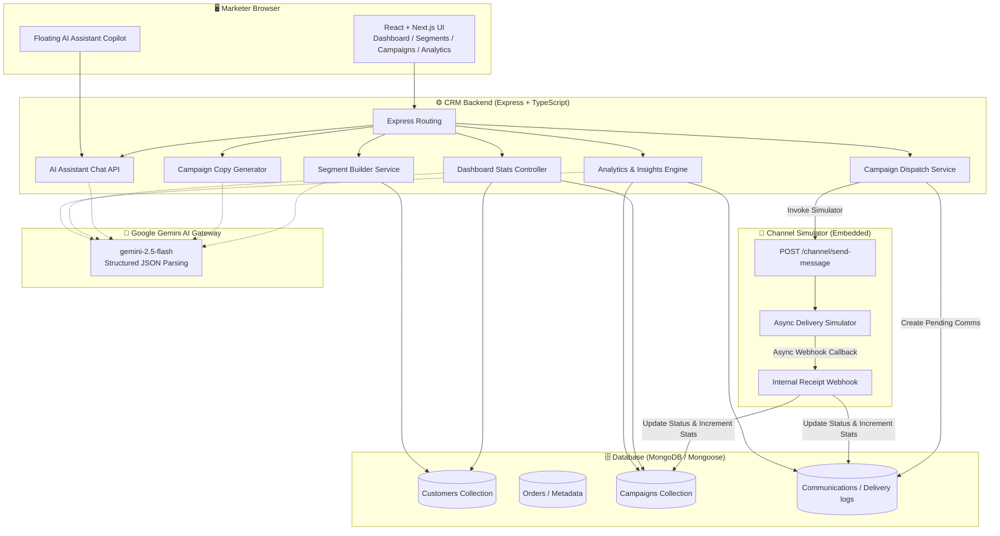

# XenoPilot CRM 🚀
### An AI-Native Mini-CRM for Reaching Shoppers

XenoPilot CRM is a production-grade, AI-native Mini-CRM designed specifically for modern D2C brands. It empowers marketers to analyze customer data, build targeted audience segments using natural language, generate high-converting multi-channel marketing campaigns, run realistic campaign simulations, and track conversion lifecycles in real-time.

---

## 🏗️ Architecture

The project is structured as a TypeScript-focused monorepo containing a **Next.js frontend** and an **Express/TypeScript backend**. 

Below is the system architecture showing how the components interact:



---

## 🤖 AI-Native Capabilities

XenoPilot CRM utilizes Google's **Gemini AI Engine** (`gemini-2.5-flash` model via the official `@google/generative-ai` SDK) to bring intelligent automations to the CRM workflow:

1. **Natural Language Segment Builder**: Converts plain English segment descriptions (e.g., *"Mumbai customers with total spend over ₹5,000"*) directly into executable MongoDB query filters.
2. **Multi-Channel Campaign Generator**: Automatically writes high-converting promotional drafts tailored for **Email**, **SMS**, or **WhatsApp** based on the target audience context and campaign objective.
3. **AI Campaign Insights**: Analyzes campaign delivery, open, click, and conversion statistics to provide three key actionable optimization ideas.
4. **Dashboard Recommendations**: Automatically scans global CRM figures (customers, orders, revenue) to recommend high-impact marketing actions (e.g., *"Upsell to high-value buyers"* or *"Win-back inactive customers"*).
5. **Interactive Copilot Chat**: A persistent conversational assistant that allows marketers to query customer analytics, draft messages, and brainstorm campaigns.
6. **Graceful Fallback Mode**: If a `GEMINI_API_KEY` is not provided, the CRM seamlessly activates local, deterministic rule-based algorithms to keep all operations functioning.

---

## ✨ Features

* **Visual Dashboard**: View overall sales revenue, order volumes, customer numbers, campaign counts, and active recommendations.
* **Customer Segment Builder**: Real-time customer search, advanced natural language filtering, and immediate list previews.
* **Campaign Manager**: Formulate, save, and review campaigns.
* **Embedded Channel Simulator**: Simulates delivery, open, click, and purchase events with custom conversion probabilities depending on the channel type (e.g., higher open rates on WhatsApp, custom click delays).
* **SMTP Integration**: Fully functional dispatch of real emails via nodemailer when an SMTP provider is configured.
* **User Authentication**: Secure JWT-based registry, login, and session persistence.

---

## 🛠️ Tech Stack

### Frontend
- **Framework**: Next.js 14 (App Router)
- **Language**: TypeScript
- **Styling**: Tailwind CSS
- **State Management**: Zustand
- **Icons**: Lucide React
- **Data Visualization**: Recharts

### Backend
- **Framework**: Express.js
- **Language**: TypeScript
- **Database**: MongoDB (Mongoose ODM)
- **AI Integration**: `@google/generative-ai` (Gemini SDK)
- **Mailing**: Nodemailer
- **Authentication**: bcrypt & JSON Web Tokens (JWT)

---

## ⚙️ Environment Variables

### Backend (`CRM/backend/.env`)
Create a `.env` file in the `backend` folder:
```env
PORT=4000
MONGO_URI=mongodb://localhost:27017/xeno-crm
FRONTEND_URL=http://localhost:3000

# Gemini API Integration
GEMINI_API_KEY=your_gemini_api_key_here

# JWT Configuration
JWT_SECRET=your_jwt_secret_key_here
JWT_EXPIRE=30d

# SMTP Configuration (Optional, for real emails)
SMTP_HOST=smtp.gmail.com
SMTP_PORT=587
SMTP_USER=your_email@gmail.com
SMTP_PASS=your_app_password_here
```

### Frontend (`CRM/frontend/.env.local`)
Create a `.env.local` file in the `frontend` folder:
```env
NEXT_PUBLIC_API_URL=http://localhost:4000
```

---

## 🚀 Installation & Local Development

Follow these steps to run the complete stack locally:

### Prerequisites
- Node.js (v18+)
- npm or yarn
- MongoDB running locally or a MongoDB Atlas connection string

### Step 1: Clone the Repository
```bash
git clone https://github.com/yuvrajguptaa/Build-an-AI-Native-Mini-CRM-for-Reaching-Shoppers.git
cd Build-an-AI-Native-Mini-CRM-for-Reaching-Shoppers
```

### Step 2: Set Up Backend
1. Navigate to the backend directory:
   ```bash
   cd backend
   ```
2. Install dependencies:
   ```bash
   npm install
   ```
3. Set up your `.env` file (see Environment Variables above).
4. Seed the database with sample customer and order data:
   ```bash
   npm run seed
   ```
5. Start the backend in development mode:
   ```bash
   npm run dev
   ```
   The backend server starts on `http://localhost:4000`.

### Step 3: Set Up Frontend
1. Open a new terminal and navigate to the frontend directory:
   ```bash
   cd ../frontend
   ```
2. Install dependencies:
   ```bash
   npm install
   ```
3. Set up your `.env.local` file (see Environment Variables above).
4. Start the frontend development server:
   ```bash
   npm run dev
   ```
   Open `http://localhost:3000` in your browser.

---

## 🌐 Deployment Instructions

### Backend Deployment (e.g., Render / Railway)
1. Set up a MongoDB Atlas cluster and get the connection string.
2. Create a new Web Service on Render or a project on Railway.
3. Connect your GitHub repository.
4. Set the Root Directory to `backend`.
5. Set Build Command to `npm run build` (runs `tsc`).
6. Set Start Command to `npm run start` (runs `node dist/server.js`).
7. Add your Environment Variables (ensure `MONGO_URI` points to MongoDB Atlas, and update `FRONTEND_URL` to your production frontend URL).

### Frontend Deployment (Vercel)
1. Go to Vercel and create a new project.
2. Link your GitHub repository.
3. Select the `frontend` folder as the Root Directory.
4. Configure framework preset as **Next.js**.
5. Add Environment Variable `NEXT_PUBLIC_API_URL` pointing to your deployed backend URL (e.g., `https://your-backend.onrender.com`).
6. Click deploy.
